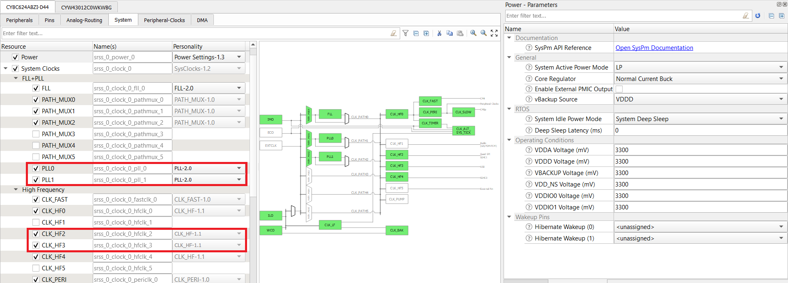

# AWS IoT and FreeRTOS for PSoC 6 MCU: WLAN Low Power

This code example demonstrates the low-power operation of the PSoC 6 MCU (host) and the WLAN device using the [Low Power Assistant (LPA) middleware](https://github.com/cypresssemiconductorco/lpa).

The code example connects to a configured Wi-Fi network. After connecting to the network successfully, the example configures the WLAN device in a power save mode, suspends the network stack, and puts the host MCU in a wait state. During this wait state, the host MCU enters a low-power state and wakes up on any network activity detected between the host MCU and the WLAN device.

[Provide feedback on this Code Example.](https://cypress.co1.qualtrics.com/jfe/form/SV_1NTns53sK2yiljn?Q_EED=eyJVbmlxdWUgRG9jIElkIjoiQ0UyMzA0ODMiLCJTcGVjIE51bWJlciI6IjAwMi0zMDQ4MyIsIkRvYyBUaXRsZSI6IkFXUyBJb1QgYW5kIEZyZWVSVE9TIGZvciBQU29DIDYgTUNVOiBXTEFOIExvdyBQb3dlciIsInJpZCI6InByYWgiLCJEb2MgdmVyc2lvbiI6IjEuMS4wIiwiRG9jIExhbmd1YWdlIjoiRW5nbGlzaCIsIkRvYyBEaXZpc2lvbiI6Ik1DRCIsIkRvYyBCVSI6IklDVyIsIkRvYyBGYW1pbHkiOiJQU09DIn0=)

## Requirements

- [ModusToolbox v2.1](https://www.cypress.com/documentation/software-and-drivers/modustoolbox-software-archives)

- Programming Language: C

- [ModusToolbox Amazon FreeRTOS SDK](https://github.com/cypresssemiconductorco/amazon-freertos)

- [Cypress Programmer](https://www.cypress.com/products/psoc-programming-solutions)

- Associated Parts: All [PSoC® 6 MCU](http://www.cypress.com/PSoC6) parts with Amazon FreeRTOS support

Install the following additional software if you are using CMake. This code example was tested with CMake version 3.15.3 and Ninja version 1.9.0.

- [CMake](https://cmake.org/download/)

- [Ninja](https://ninja-build.org/) 

## Supported Toolchains (make variable 'TOOLCHAIN')

- GNU Arm Embedded Compiler v7.2.1 (GCC_ARM) - Default value of `TOOLCHAIN`

- Arm compiler v6.11 (ARM)

- IAR C/C++ compiler v8.42.2 (IAR)

## Supported Kits (make variable 'TARGET')

- [PSoC 6 Wi-Fi BT Prototyping Kit](https://www.cypress.com/CY8CPROTO-062-4343W) (CY8CPROTO-062-4343W) - Default value of `TARGET`

- [PSoC 62S2 Wi-Fi BT Pioneer Kit](https://www.cypress.com/CY8CKIT-062S2-43012) (CY8CKIT-062S2-43012)

- [PSoC 6 Wi-Fi BT Pioneer Kit](https://www.cypress.com/CY8CKIT-062-WiFi-BT) (CY8CKIT-062-WIFI-BT)

## Hardware Setup

This example uses the board's default configuration. See the kit user guide to ensure that the board is configured correctly.

**Note:** The PSoC 6 BLE Pioneer Kit (CY8CKIT-062-BLE) and the PSoC 6 WiFi-BT Pioneer Kit (CY8CKIT-062-WIFI-BT) ship with KitProg2 installed. The ModusToolbox software requires KitProg3. Before using this code example, make sure that the board is upgraded to KitProg3. The tool and instructions are available in the [Firmware Loader](https://github.com/cypresssemiconductorco/Firmware-loader) GitHub repository. If you do not upgrade, you will see an error like "unable to find CMSIS-DAP device" or "KitProg firmware is out of date".

## Software Setup

Install a terminal emulator if you don't have one. Instructions in this document use [Tera Term](https://ttssh2.osdn.jp/index.html.en).

This example requires no additional software or tools.

## Using the Code Example

### First Steps:

The steps in this section are a one time activity by the user. The following commands clone the Amazon FreeRTOS repository, check out the specified branch, and then finally clone this code example.

1. Clone the ModusToolbox Amazon FreeRTOS SDK from [GitHub](https://github.com/cypresssemiconductorco/amazon-freertos). The following command clones all the submodules.

   ```
   git clone https://github.com/cypresssemiconductorco/amazon-freertos.git -b 202007-MTBAFR2041 --recurse-submodules
   ```

2. Go to *<amazon-freertos>/projects/cypress* folder. Clone or download this code example, or copy it if you already have it.

   ```
   git clone https://github.com/cypresssemiconductorco/afr-example-wlan-lowpower.git
   ```

   Alternatively, clone the example outside of *amazon-freertos* directory but make sure that `AFR_PATH` and `CY_AFR_ROOT` are set correctly in *CMakeLists.txt* and *Makefile* respectively. If you use Eclipse IDE for ModusToolbox, you must clone the code example under *<amazon-freertos>/projects/cypress* because the Eclipse project files use relative paths to link to the files under <amazon-freertos>.

3. Connect the board to your PC using the provided USB cable through the KitProg3 USB connector.

4. Open a terminal program and select the KitProg3 COM port. Set the serial port parameters to 8N1 and 115200 baud.


### In Eclipse IDE for ModusToolbox:

1. Go to **File** > **Import**.

2. Choose **Existing Projects into Workspace** under **General** and click **Next**. 

3. Click the **Browse** button near **Select root directory**, choose the CE folder *\<amazon-freertos>/projects/cypress/afr-example-wlan-lowpower*, and click **Finish**. 

4. Select the application project in the Project Explorer.

5. In the **Quick Panel**, scroll down, and click **afr-example-wlan-lowpower Program (KitProg3)**.

To program a target board different from the default one defined using the `TARGET` variable in the Makefile, you need to generate the launch configurations for the new target. See [Running FreeRTOS Code Examples - KBA228845](https://www.cypress.com/KBA228845) for details.

### Using Make Command Line Interface (CLI):

1. Download and unzip this repository onto your local machine, or clone the repository.

2. Open a CLI terminal and navigate to the application folder. 

   On Linux and macOS, you can use any terminal application. On Windows, navigate to the modus-shell directory (*{ModusToolbox install directory}/tools_\<version>/modus-shell*) and run *Cygwin.bat*.

3. From the terminal, execute the `make program` command to build and program the application using the default toolchain to the default target. You can specify a target and toolchain manually:

   ```
   make program TARGET=<BSP> TOOLCHAIN=<toolchain>
   ```
   Example:

   ```
   make program TARGET=CY8CPROTO-062-4343W TOOLCHAIN=GCC_ARM
   ```

### Using CMake CLI:

1. Go to *\<amazon-freertos>/projects/cypress/afr-example-wlan-lowpower* folder.

2. Run the following command. This command will generate a build configuration under a new folder called *build* in the current directory.

   ```
   cmake -DVENDOR=cypress -DCOMPILER=arm-gcc -DBOARD=CY8CPROTO_062_4343W -S . -B build -G Ninja -DCMAKE_TOOLCHAIN_FILE=../../../tools/cmake/toolchains/arm-gcc.cmake
   ```

3. Once CMake has generated the configuration, run the following command to build the project:

   ```
   cmake --build build
   ```
   To clean and then build, use the following command:

   ```
   cmake --build build --clean-first
   ```

4. Program the *\<Application Name>.elf* file generated under the *build* folder using Cypress Programmer.

## Operation

1. Connect the board to your PC using the provided USB cable through the KitProg3 USB connector.

2. Open a terminal program and select the KitProg3 COM port. Set the serial port parameters to 8N1 and 115200 baud.

3. Modify the `WIFI_SSID`, `WIFI_PASSWORD`, and `WIFI_SECURITY` macros to match credentials to that of the Wi-Fi network you want to connect to. These macros are defined in the *lowpower_task.h* file.

   **Note:** See the AP's configuration page for the security type. See the `WIFISecurity_t` enumeration in *iot_wifi.h* to pass the corresponding security type in the `WIFI_SECURITY` macro.

4. Ensure that your computer is connected to the same Wi-Fi AP that you have configured in Step 3.

5. Build the code example and program the board by following the steps given for your choice of build system (Eclipse IDE for ModusToolbox, Make, or CMake) in the previous sections. After programming, the following logs will appear on the serial terminal:

    ```
    2 0 [Tmr Svc] Info: 3 1 [Tmr Svc] ================================================
    4 1 [Tmr Svc] Info: 5 2 [Tmr Svc] AWS IoT and FreeRTOS for PSoC 6: WLAN Low Power
    6 2 [Tmr Svc] Info: 7 3 [Tmr Svc] ================================================

    WLAN MAC Address : E8:E8:B7:A0:29:1C
    WLAN Firmware    : wl0: Jan 27 2020 21:57:29 version 13.10.271.236 (5a526db) FWID 01-61e2b002
    WLAN CLM         : API: 18.2 Data: 9.10.0 Compiler: 1.36.1 ClmImport: 1.34.1 Creation: 2020-01-27 21:54:33
    WHD VERSION      : v1.90.2 : v1.90.2 : GCC 7.2 : 2020-04-13 02:49:57 -0500
    Offloads not configured
    8 2352 [Tmr Svc] Info: 9 2352 [Tmr Svc] Wi-Fi module initialized. Connecting to AP: WIFI_SSID
    10 12305 [IOT-Wifi-] Notify application that IP is changed!
    11 12329 [Tmr Svc] Info: 12 12330 [Tmr Svc] Wi-Fi connected to AP: WIFI_SSID
    13 12330 [Tmr Svc] Info: 14 12331 [Tmr Svc] IP Address acquired: 192.168.0.16
    15 12348 [iot_threa] Info: 16 12348 [iot_threa] Beacon period = 100, DTIM period = 1

    Network Stack Suspended, MCU will enter DeepSleep power mode
    ```

6. Open a command prompt and ping the IP address displayed on the serial terminal:

    ```
    ping <IP address>
    ```

   The network stack is resumed. The device displays the deep sleep and Wi-Fi SDIO bus statistics on the terminal as follows:

    ```
    Resuming Network Stack, Network stack was suspended for 10559ms
    
    =====================================================
    WHD Stats..
    tx_total:68, rx_total:70, tx_no_mem:0, rx_no_mem:0
    tx_fail:0, no_credit:0, flow_control:0
    Bus Stats..
    cmd52:2260, cmd53_read:363, cmd53_write:568
    cmd52_fail:0, cmd53_read_fail:0, cmd53_write_fail:0
    oob_intrs:71, sdio_intrs:142, error_intrs:0, read_aborts:0
    =====================================================
    Network is active. Resuming network stack
    ```

   **Note:** The host MCU will wake up on any network activity and not necessarily due to pings from the PC. The reasons for network activity could be broadcast or multicast packets issued by the AP. 
   
   Further power savings can be made by employing offload features such as packet filtering, which will increase the time the host MCU will be in deep sleep. See [AN227910 - Low-Power System Design with CYW43012 and PSoC 6 MCU](https://www.cypress.com/documentation/application-notes/an227910-low-power-system-design-cyw43012-and-psoc-6-mcu) for more details.

See [Measuring Current Consumption](#measuring-current-consumption) for instructions on how to measure the current consumed by the PSoC 6 MCU and Wi-Fi devices.

## Debugging

You can debug the example to step through the code. In the IDE, use the **\<Application Name> Debug (KitProg3)** configuration in the **Quick Panel**. For more details, see the "Program and Debug" section in the [Eclipse IDE for ModusToolbox User Guide](https://www.cypress.com/MTBEclipseIDEUserGuide).

**Note:** **(Only while debugging)** On the CM4 CPU, some code in `main()` may execute before the debugger halts at the beginning of `main()`. This means that some code executes twice - before the debugger stops execution, and again after the debugger resets the program counter to the beginning of `main()`. See [KBA231071](https://community.cypress.com/docs/DOC-21143) to learn about this and for the workaround.

## Design and Implementation

This application uses the lwIP network stack, which runs multiple network timers for various network-related activities. These timers need to be serviced by the host MCU. As a result, the host MCU will not be able to stay in sleep or deep sleep state longer. 

In this example, after successfully connecting to an AP, the host MCU suspends the network stack after a period of inactivity. The example uses two macros, `NETWORK_INACTIVE_INTERVAL_MS` and `NETWORK_INACTIVE_WINDOW_MS`, to determine whether the network is inactive. The network is monitored for inactivity in an interval of length `NETWORK_INACTIVE_INTERVAL_MS`. If the network is inactive for a continuous duration specified by `NETWORK_INACTIVE_WINDOW_MS`, the network stack will be suspended until there is network activity.

The host MCU is alerted by the WLAN device on network activity after which the network stack is resumed. The host MCU is in deep sleep during the time the network stack is suspended. Because there are no network timers to be serviced, the host MCU will stay in deep sleep for longer. This state where the host MCU is in deep sleep waiting for network activity is referred to as "wait state".

On the other hand, the WLAN device is configured in one of the supported power save modes:

1. **Power-save with Poll:** This mode corresponds to (legacy) 802.11 PS-Poll mode and should be used to achieve the lowest power consumption possible when the Wi-Fi device is primarily passively listening to the network.

2. **Power-save Without Poll:** This mode attempts to increase the throughput by waiting for a timeout period before returning to sleep rather than returning to sleep immediately.

The power-save mode can be set through the `WLAN_POWERSAVE_MODE` macro. The WLAN device wakes at every DTIM interval to receive beacon frames from the AP.

For more information on low-power system design that involves offloading tasks to the WLAN device for even better power savings, see [AN227910 - Low-Power System Design with CYW43012 and PSoC 6 MCU](https://www.cypress.com/documentation/application-notes/an227910-low-power-system-design-cyw43012-and-psoc-6-mcu).

### Creating a Custom Device Configuration for Low Power

This code example overrides the default device configuration provided in *<amazon-freertos>/vendors/cypress/boards/\<kit>/aws_demos/application_code/cy_code/GeneratedSource/* with the one provided in *<application_folder>/COMPONENT_CUSTOM_DESIGN_MODUS/TARGET_\<kit>* for the supported kits.  

The custom configuration disables the Phase-Locked Loop (PLL), disables the HF clock for unused peripherals like audio/USB, and configures the Buck regulator instead of the Low Dropout (LDO) regulator to power the PSoC 6 MCU device. This configuration reduces the current consumed by the PSoC 6 MCU device in active state.  

If your application uses any of the disabled peripherals, the corresponding peripherals and clocks should be enabled using the Device Configurator. Launch this tool from the **Quick Panel** inside the Eclipse IDE for ModusToolbox, or from the command line using the following command:

```
make config TARGET=CY8CKIT-062S2-43012
```

Do the following to create a custom configuration for a new kit. The steps are provided for **CY8CKIT-062S2-43012** kit; however, other supported kits can be configured in a similar way.

1. Create a new directory inside *COMPONENT_CUSTOM_DESIGN_MODUS* with the same name as the target you are building the example for, such as *<application_folder>/COMPONENT_CUSTOM_DESIGN_MODUS/TARGET_\<kit>*.

2. Copy the *design.modus* file from the *<amazon-freertos>/vendors/cypress/boards/\<kit>/aws_demos/application_code/cy_code/* folder into the folder created in the previous step.

   **Note:** The *design.cycapsense* and *design.qspi* files can also be copied so that you don't have to configure these peripherals again. All you have to do is to enable these peripherals in *design.modus* to use them.  

3. Open the copied *design.modus* file using Device Configurator.

4. Do the following on the PSoC 6 MCU **Pins** tab of the Device Configurator tool:

   1. Enable the Host Wake pin **P4[1]** and name it *CYBSP_WIFI_HOST_WAKE*.

   2. In the **Parameters** pane, change the following:

       - **Drive Mode:** Analog High-Z. Input buffer off

       - **Initial Drive State:** High(1)

       - **Interrupt Trigger Type:** Rising Edge

       **Figure 1. Configuring Host Wake Pin for CY8CKIT-062S2-43012**
       

   **Note:** The Wi-Fi host driver takes care of the drive mode configuration of the Host Wake pin.

   The Host Wake pin (*CYBSP_WIFI_HOST_WAKE*) is different for each supported kit. See the board file *cybsp_types.h* present under *<amazon-freertos>/vendors/cypress/boards/\<kit>/aws_demos/application_code/cy_code/* and search for the `CYBSP_WIFI_HOST_WAKE` macro in the file for the Host Wake pin.

5. Go to the **Wi-Fi** tab and enable the host wake configuration and set **Host Device Interrupt Pin** to `CYBSP_WIFI_HOST_WAKE`. This configuration is applicable to all supported kits.

    **Figure 2. Enable Host Wake Pin**
    

6. Switch to the **System** tab, expand the **System Clocks** resource, and do the following:
   
   1. Clear the box in the **FLL+PLL** section to disable the PLL.

   2. In the **High Frequency** section, disable HF clocks for the peripherals that are not being used in this code example.

       **Figure 3. Clock Settings in CY8CKIT-062S2-43012**
       

   3. In the **System Clocks** resource, select **CLK_HF0** and modify the **Source Clock** to **CLK_PATH0**.

      **Figure 4. CLK_HF0 Settings for CY8CKIT-062S2-43012**
      

7. Under the **Power** resource, change the **Core Regulator** under **General** to **Buck**.

   **Figure 5. Configuring Core Regulator as Buck**
   

8. Optionally, you can make higher power savings by switching to ULP (Ultra Low Power) mode. However, this mode requires the CM4 CPU to be limited to a maximum operating frequency of 50 MHz. Switching to ULP mode causes a few warnings to appear for **FLL** and **CLK_PERI** because their frequencies are greater than 50 MHz and 25 MHz respectively. Therefore, configure the **FLL Desired Frequency** to 50 MHz, and set the **CLK_PERI** divider to **2**.

    1. Under the **Power** resource, change the **System Active Power Mode** under **General** to **ULP**. 

       **Figure 6. Configuring System Active Power Mode**
       

    2. Under the **System** tab, expand the **System Clocks** resource, select **FLL**, and modify the **Desired Frequency** to **50.000 MHz**.

       **Figure 7. FLL Settings**
       

   **Note:**

   For the *CY8CKIT-062-WIFI-BT* kit, the PSoC 6 MCU device consists of a UDB-based SDHC block for SDIO communication with the WLAN device. This requires the **System Active Power Mode** to be configured with **LP** mode to run the peripheral clocks at 100 MHz.

9. Save the file to generate the source files.

10. Disable the default configuration and enable the custom configuration by making the following changes:

    **Using Make build system:** 
    
    Add the following in *Makefile*.

    ```
    COMPONENTS += CUSTOM_DESIGN_MODUS
    ```

    **Using CMake build system:** 
    
    Do the following in *CMakeLists.txt* to pick the custom design configuration. The following the snippets are captured from the *CMakeLists.txt* file; these highlight the changes needed for selecting the custom design configuration. See the *CMakeLists.txt* file directly to learn about the complete configuration flow.

    - Set an option *CUSTOM_DESIGN_MODUS*.

      ```
      option(CUSTOM_DESIGN_MODUS "Use custom design configuration.")
      ```

    - Add the *GeneratedSource* folder present under *COMPONENT_CUSTOM_DESIGN_MODUS/TARGET_<kit>/* to the part of the build.

      ```
      set(CY_APP_DESIGN_MODUS_DIR      "${CY_APP_DIR}/COMPONENT_CUSTOM_DESIGN_MODUS/TARGET_${APP_BOARD_NAME}/GeneratedSource" )

      if (DEFINED CUSTOM_DESIGN_MODUS)
          list(APPEND additional_include_dirs     "${CY_APP_DESIGN_MODUS_DIR}")
      else()
          list(APPEND additional_include_dirs     "${BOARD_CY_CODE_DIR}/GeneratedSource")
      endif()

      set(CY_INCLUDE_DIRS ${additional_include_dirs} CACHE INTERNAL "")

      # Application sources
      file(GLOB_RECURSE CY_APP_EXTRA_SOURCES
          ...
          ...
      if (DEFINED CUSTOM_DESIGN_MODUS)
          "${CY_APP_DESIGN_MODUS_DIR}/*.c"
          "${CY_APP_DESIGN_MODUS_DIR}/*.h"
      endif()
          ...
          ...
      )
      ```

    - Exclude the default BSP design sources:

      ```
      if (DEFINED CUSTOM_DESIGN_MODUS)
          foreach(item ${exe_glob_files})
              if(${item} MATCHES "GeneratedSource")
                  list(REMOVE_ITEM exe_glob_files ${item})
              endif(${item} MATCHES "GeneratedSource")
          endforeach()
      endif()
      ```

## Measuring Current Consumption

### CY8CKIT-062S2-43012

**For PSoC 6 MCU:** 
   1. Remove J25 to eliminate leakage currents across the potentiometer R1.
   
   2. Measure the current at J15 across VTARG and P6_VDD.  

**For CYW43012:** 
   1. Measure the current at VDDIO_WL used for the SDIO communication interface, and at VBAT used for powering CYW43xxx. 

   2. Measure at VDDIO_WL across VDDIO_WL and VCC_VDDIO2 at J17.

   3. Measure at VBAT across VBAT and VCC_VBAT at J8. 


### CY8CPROTO-062-4343W

**For PSoC 6 MCU:** 
   1. Remove R65 on the right of the board close to the USB connector of the PSoC 6 MCU device.

   2. Connect an ammeter between VTARG (J2.32) and P6_VDD (J2.24). 

   3. Remove R24 at the back of the board, below J1.9, to eliminate the leakage current. 

      R24 is the pull-up resistor attached to the WL_HOST_WAKE pin P0_4, which leaks approximately 330 uA because P0_4 is driven LOW when there is no network activity. In total, the PSoC 6 MCU deep sleep current is approximately 350 uA. 

**For CYW4343W:** 

Measure the current at the VDDIO_1LV supply used for the SDIO communication interface, and at VBAT1 and VBAT2 supplies used for powering CYW4343W. VBAT1 and VABT2 are shorted to each other. 

1. Remove R87 on the back of the board towards the right and above J2.33. 
   
2. Connect an ammeter between the pads of R87 to measure the current.

3. Measure the current at VDDIO_1LV:

   1. Remove the resistor R86 on the back of the board, below J1.27. 
   
   2. Connect an ammeter between the pads of R86 to measure the current. 

Note that the current at VDDIO_1LV will depend on the SDIO transactions that happen because of the pull-up resistors on the lines to VDDIO_1LV. Also, VDDIO_1LV (named VDDIO_1DX in the carrier module (CY8CMOD_062_4343W) schematic) allows a current of 38 uA through R24 because WL_HOST_WAKE is LOW. This current needs to be deducted from the observed value of VDDIO_1LV.

### CY8CKIT-062-WIFI-BT

**For PSoC 6 MCU:**

Connect an ammeter to the PWR MON jumper J8.

**For CYW4343W:**

Measure the current at supplies WL_VBAT used for powering CYW4343W, and WL_VDDIO used for the SDIO communication interface.

1. Measure the current at WL_VBAT:
   1. Remove L3 at the right edge of the board close to the CYW4343W module.

   2. Connect an ammeter between the pads of L3.

2. Measure the current at WL_VDDIO:
   1. Remove L7 at the top left corner on the back of the board.
   
   2. Connect an ammeter between the pads of L7.

## Typical Current Measurement Values

Table 1 provides the typical current measurement values for the CY8CKIT-062S2-43012 kit. All measurements were made in the presence of external radio interference and not in an isolated environment with a single AP. Note that the typical values of current consumed by the supply powering the SDIO interface between the host MCU and WLAN device are not provided because the value of current varies with the transaction over the interface.

Here, PSoC 6 MCU is operated with Arm® Cortex®-M4 running at 50 MHz in Ultra Low Power (ULP) mode with full RAM retention.

**Table 1. Typical Current Values for CY8CKIT_062S2_43012**
<table style="width:80%"> 
<tr><th>State</th><th>Device</th><th>Current</th></tr>
        <tr>
            <td rowspan=2>Deep Sleep</td>
            <td>PSoC 6</td>
            <td> 14.8 uA</td>
        </tr>
        <tr>
            <td>CYW43012 (VBAT)</td>
            <td> 2.5 uA</td>
        </tr>
        <tr>
            <td rowspan=2>Average current over 3 DTIM periods for<br>AP (2.4 GHz) Beacon Interval of 100 and<br>AP DTIM of 1</td>
            <td>PSoC 6</td>
            <td> 14.2 uA</td>
        </tr>
        <tr>
            <td>CYW43012 (VBAT)</td>
            <td> 451 uA</td>
        </tr>
        <tr>
            <td rowspan=2>Average current over 3 DTIM periods for<br>AP (2.4 GHz) Beacon Interval of 100 and<br>AP DTIM of 3</td>
            <td>PSoC 6</td>
            <td> 14.3 uA</td>
        </tr>
        <tr>
            <td>CYW43012 (VBAT)</td>
            <td> 162 uA</td>
        </tr>
        <tr>
            <td rowspan=2>Average current over 3 DTIM periods for<br>AP (5 GHz) Beacon Interval of 100 and<br>AP DTIM of 1</td>
            <td>PSoC 6</td>
            <td> 14.6 uA</td>
        </tr>
        <tr>
            <td>CYW43012 (VBAT)</td>
            <td> 189 uA</td>
        </tr>
        <tr>
            <td rowspan=2>Average current over 3 DTIM periods for<br>AP (5 GHz) Beacon Interval of 100 and<br> AP DTIM of 3</td>
            <td>PSoC 6</td>
            <td> 14.7 uA</td>
        </tr>
        <tr>
            <td>CYW43012 (VBAT)</td>
            <td> 107 uA</td>
        </tr>        
 </table> 


## Related Resources

| Application Notes                                            |                                                              |
| :----------------------------------------------------------- | :----------------------------------------------------------- |
| [AN228571](https://www.cypress.com/AN228571) – Getting Started with PSoC 6 MCU on ModusToolbox | Describes PSoC 6 MCU devices and how to build your first application with ModusToolbox |
| [AN227910](http://www.cypress.com/AN227910) – Low-Power System Design with PSoC 6 MCU and CYW43012 | Describes how to implement a low-power system design.        |
| **Code Examples**                                            |                                                              |
| [Using ModusToolbox](https://github.com/cypresssemiconductorco/Code-Examples-for-ModusToolbox-Software) | [Using PSoC Creator](https://www.cypress.com/documentation/code-examples/psoc-6-mcu-code-examples) |
| **Device Documentation**                                     |                                                              |
| [PSoC 6 MCU Datasheets](http://www.cypress.com/search/all?f[0]=meta_type%3Atechnical_documents&f[1]=resource_meta_type%3A575&f[2]=field_related_products%3A114026) | [PSoC 6 MCU Technical Reference Manuals](https://www.cypress.com/search/all/PSoC%206%20Technical%20Reference%20Manual?f[0]=meta_type%3Atechnical_documents&f[1]=resource_meta_type%3A583) |
| **Development Kits**                                         | Buy at www.cypress.com                                     |
| [CY8CKIT-062S2-43012 PSoC 62S2 WiFi-BT Pioneer Kit](http://www.cypress.com/CY8CKIT-062S2-43012) |[CY8CPROTO-062-4343W PSoC 6 Wi-Fi BT Prototyping Kit](http://www.cypress.com/CY8CPROTO-062-4343W)|
| [CY8CKIT-062-WIFI-BT PSoC 62 WiFi-BT Pioneer Kit](http://www.cypress.com/CY8CKIT-062-WIFI-BT) |
| **Libraries**                                                |                                                              |
| PSoC 6 Peripheral Driver Library (PDL) and docs | [psoc6pdl](https://github.com/cypresssemiconductorco/psoc6pdl) on GitHub |
| Cypress Hardware Abstraction Layer Library (HAL) and docs          | [psoc6hal](https://github.com/cypresssemiconductorco/psoc6hal) on GitHub |
| **Middleware**                                               | Middleware libraries are distributed on GitHub               |
| Low Power Assistant (LPA)  | [lpa](https://github.com/cypresssemiconductorco/lpa) on GitHub |
| CapSense® library and docs                                    | [capsense](https://github.com/cypresssemiconductorco/capsense) on GitHub |
| Links to all PSoC 6 MCU Middleware                               | [psoc6-middleware](https://github.com/cypresssemiconductorco/psoc6-middleware) on GitHub |
| **Tools**                                                    |                                                              |
| [Eclipse IDE for ModusToolbox](https://www.cypress.com/modustoolbox)     | The cross-platform, Eclipse-based IDE for IoT designers that supports application configuration and development targeting converged MCU and wireless systems.             |
| [PSoC Creator™](https://www.cypress.com/products/psoc-creator-integrated-design-environment-ide) | The Cypress IDE for PSoC and FM0+ MCU development.            |

Cypress provides a wealth of data at www.cypress.com to help you to select the right device, and quickly and effectively integrate it into your design.

For PSoC 6 MCU devices, see [How to Design with PSoC 6 MCU - KBA223067](https://community.cypress.com/docs/DOC-14644) in the Cypress community.


## Document History

Document Title: *CE230483 - AWS IoT and FreeRTOS for PSoC 6: WLAN Low Power*

| Version | Description of Change |
| ------- | --------------------- |
| 1.0.0   | New code example      |
| 1.1.0   | Removed unwanted design files |

------

All other trademarks or registered trademarks referenced herein are the property of their respective owners.


-------------------------------------------------------------------------------

© Cypress Semiconductor Corporation, 2020. This document is the property of Cypress Semiconductor Corporation and its subsidiaries ("Cypress"). This document, including any software or firmware included or referenced in this document ("Software"), is owned by Cypress under the intellectual property laws and treaties of the United States and other countries worldwide. Cypress reserves all rights under such laws and treaties and does not, except as specifically stated in this paragraph, grant any license under its patents, copyrights, trademarks, or other intellectual property rights. If the Software is not accompanied by alicense agreement and you do not otherwise have a written agreement with Cypress governing the use of the Software, then Cypress hereby grants you a personal, non-exclusive, nontransferable license (without the right to sublicense) (1) under its copyright rights in the Software (a) for Software provided in source code form, to modify and reproduce the Software solely for use with Cypress hardware products, only internally within your organization, and (b) to distribute the Software in binary code form externally to end users (either directly or indirectly through resellers and distributors), solely for use on Cypress hardware product units, and (2) under those claims of Cypress's patents that are infringed by the Software (as provided by Cypress, unmodified) to make, use, distribute, and import the Software solely for use with Cypress hardware products. Any other use, reproduction, modification, translation, or compilation of the Software is prohibited.
TO THE EXTENT PERMITTED BY APPLICABLE LAW, CYPRESS MAKES NO WARRANTY OF ANY KIND, EXPRESS OR IMPLIED, WITH REGARD TO THIS DOCUMENT OR ANY SOFTWARE OR ACCOMPANYING HARDWARE, INCLUDING, BUT NOT LIMITED TO, THE IMPLIED WARRANTIES OF MERCHANTABILITY AND FITNESS FOR A PARTICULAR PURPOSE. No computing device can be absolutely secure. Therefore, despite security measures implemented in Cypress hardware or software products, Cypress shall have no liability arising out of any security breach, such as unauthorized access to or use of a Cypress product. CYPRESS DOES NOT REPRESENT, WARRANT, OR GUARANTEE THAT CYPRESS PRODUCTS, OR SYSTEMS CREATED USING CYPRESS PRODUCTS, WILL BE FREE FROM CORRUPTION, ATTACK, VIRUSES, INTERFERENCE, HACKING, DATA LOSS OR THEFT, OR OTHER SECURITY INTRUSION (collectively, "Security Breach"). Cypress disclaims anyliability relating to any Security Breach, and you shall and hereby do release Cypress from any claim, damage, or other liability arising from any Security Breach. In addition, the products described in these materials may contain design defects or errors known as errata which may cause the product to deviate from published specifications. To the extent permitted by applicable law, Cypress reserves the right to makechanges to this document without further notice. Cypress does not assume any liability arising out of the application or use of any product or circuit described in this document. Any information provided in this document, including any sample design information or programming code, is provided only for reference purposes. It is the responsibility of the user of this document to properly design, program, and test thefunctionality and safety of any application made of this information and any resulting product. "High-Risk Device" means any device or system whose failure could cause personal injury, death, or property damage. Examples of High-Risk Devices are weapons, nuclear installations, surgical implants, and other medical devices. "Critical Component" means any component of a High-Risk Device whose failure to perform can be reasonably expected to cause, directly or indirectly, the failure of the High-Risk Device, or to affect its safety or effectiveness. Cypress is not liable, in whole or in part, and you shall and hereby do release Cypress from any claim, damage, or other liability arising from any use of a Cypress product as a Critical Component in a High-Risk Device. You shall indemnify and hold Cypress, its directors, officers, employees, agents, affiliates, distributors, and assigns harmless from and against all claims, costs, damages, and expenses, arising out of any claim, including claims for product liability, personal injury or death, or property damage arising from any use of a Cypress product as a Critical Component in a High-Risk Device. Cypress products are not intended or authorized for use as a Critical Component in any High-Risk Device except to the limited extent that (i) Cypress's published data sheet for the product explicitly states Cypress has qualified the product for use in a specific High-Risk Device, or (ii) Cypress has given you advance written authorization to use the product as a Critical Component in the specific High-Risk Device and you have signed a separate indemnification agreement.
Cypress, the Cypress logo, Spansion, the Spansion logo, and combinations thereof, WICED, PSoC, CapSense, EZ-USB, F-RAM, and Traveo are trademarks or registered trademarks of Cypress in the United States and other countries. For a more complete list of Cypress trademarks, visit cypress.com. Other names and brands may be claimed as property of their respective owners.

